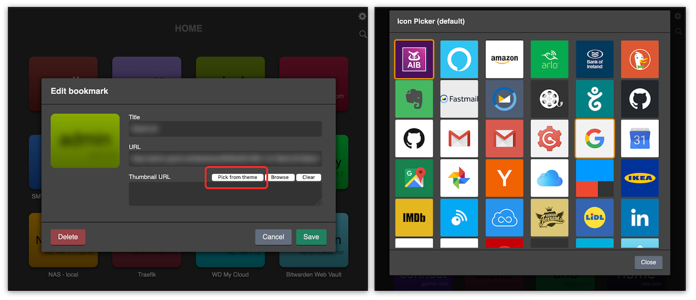

# Perfect Home - Themes

This is the place where you can find (and contribute your own) themes for the [Perfect Home](https://addons.mozilla.org/en-US/firefox/addon/perfect-home) firefox addon.

## What is a Theme?
It's basically a folder in this repo, containing one of these (or both):
- Thumbnails for websites - any number and any website.
- Custom CSS - that one can just copy & paste in settings and it will change the look & feel of the Perfect Home page.

## How to use a Theme?

### Directly from the extension settings
- Open the extension settings (clicking the cog icon in the top-right corner)
- Make sure to enable "**Allow Github**" in the **Privacy** section
- In "Customize" section - select a theme.
- If the selected theme had a CSS - it should be applied now
- To use any of the theme thumbnails - you need to edit any bookmark and in the edit window click "Pick from theme" button (this button will only show up if Themes are enabled and a Theme is selected):

### Manually
- For custom CSS it's easy - just copy the css code and paste it in the Extension's settings "Custom CSS" field.
- For thumbnails images - whatever works best for you:
  - You can download this repo (or just a theme folder) and replace thumbnails for your bookmarks from there (thumbnails are cached in the extension, so you can even delete the folder afterwards). This is the preferred method, as it doesn't require internet to load your homepage (all images are cached).
  - You can click on an image and copy a link to it and paste as a custom thumbnail (remember to copy the Raw image url, not the github page's one). This will be a bit slower (depending on your connection), as the page needs to load the remote images.

## Contribution rules

### Naming conventions
There are a couple of restrictions to the theme and file names:
- Folder name (obviously, as it's a folder) must be unique and must start with `theme-`.
- If you wish, you can add namespace like so: `theme-tom123-mydarktheme`.
- A nice screenshot of either the *Perfect Home* page or just the thumbnails (e.g. from a graphical app) with a name: `_screenshot.png`. This will be used as a preview on the future themes site.
- `README.md` file inside the theme folder should contain:
  - A good description in markdown format.
  - Some nice screenshots.
  - Author's contact details (email/github username), so when something doesn't work, people know who to ask.
- For future updates and contributions it would be good to include a template/file from the graphical application you've used (e.g. Sketch, Figma, Powerpoint), with a specific name e.g. `_template.extension` (e.g. `_template.sketch`).
- General rule is that files with `_` in front of the name will not be considered as icons, otherwise all PNG files inside the theme folder will be considered as such.

You can have a look at the sample themes that are already in the repo.
Once we have a decent number of themes, there's a plan to create some sort of a gallery website :smile:.

# Themes - FAQ

### Changing a theme doesn't do anything
It doesn't have to do anything. 
Theme does not have to contain an `index.css` file, and if it doesn't - nothing will change.

### When I change a theme my icons/thumbnails don't change
This is by design! 
When you select an icon - it is converted to a DataURI format and stored in your browser's cache (for speed and stability). So when you change a theme - nothing happens.
If you want to change a bookmark icon/thumbnail, you can do so by editing a bookmark and selecting a new icon from the new theme.
